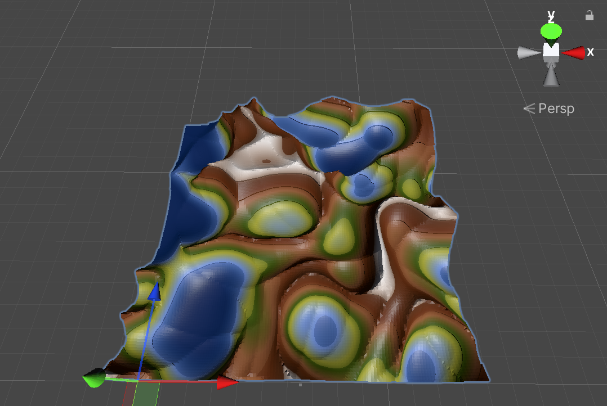
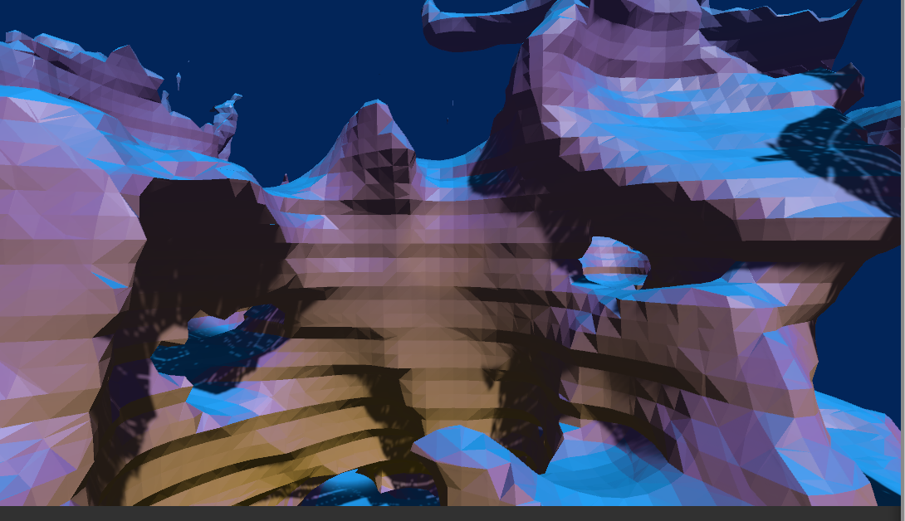

# MarchingCube in Unity
 Unity2020.3.22f1
 
 URP 10.7.0
 
 MarchingCube using

| Scene | Image| | Description |
| --- | - | --- |--- |
| `MarchingCube Iter` |  | |martchingcube算法使用 ||
| `MarchingCube Terrain` |  | |martchingcube地形生成 ||
| `MarchingCube SeaWorld` |  | https://www.bilibili.com/video/bv1ou411z72k |martchingcube海底地形生成 ||

refrences: 
http://paulbourke.net/geometry/polygonise/ 
https://developer.nvidia.com/gpugems/gpugems3/part-i-geometry/chapter-1-generating-complex-procedural-terrains-using-gpu 
